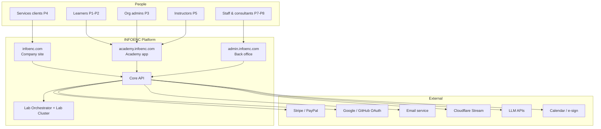
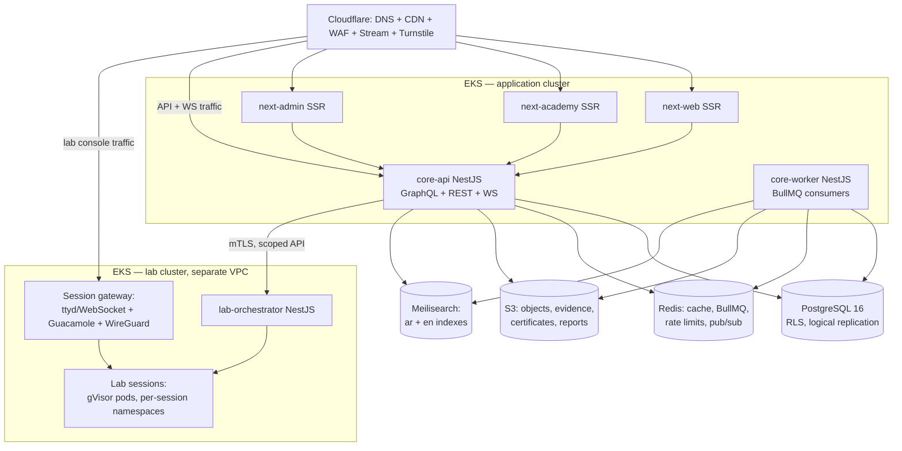

# 01 — Architecture Overview

## 1. Principles (in priority order)

1. **Isolation before features.** Client engagement data (NFR-021) and lab workloads (NFR-022) get structural isolation — enforced by the database and the network, not by application-code discipline alone.
2. **Boring core, sharp edges.** Postgres, Redis, S3, Kubernetes — proven primitives. Innovation budget is spent where INFOENC differentiates: lab experience, bilingual delivery, automation.
3. **Modular monolith, deliberate seams.** One deployable core API with compiler-enforced module boundaries; a module graduates to a service only when it has a distinct scaling profile, security domain, or failure domain (today: lab orchestration).
4. **Everything is an event (too).** State changes emit domain events through a transactional outbox; gamification, notifications, automation, and analytics are consumers — never inline coupling in request paths.
5. **Bilingual is plumbing, not paint.** Locale flows through every layer: API responses, queue jobs, emails, PDFs, search indexes.
6. **Operable by few.** One observability stack, one deploy mechanism, one queue technology. Every component must justify its 3 a.m. pager cost.

## 2. System context (C4 level 1)

Client portal note: services clients (P4) use a portal section of `infoenc.com` (`/portal`) rather than a fourth app — same design language as the marketing site, shared auth, small surface (doc 04 §2).

## 3. Container view (C4 level 2)

Key structural facts:

- **Two Kubernetes clusters, two VPCs.** The lab cluster runs hostile-by-design workloads (learners are *supposed* to attack things). It has no route to the application VPC; the orchestrator exposes one mTLS API consumed only by core-api. Compromise of a lab node must be a contained, expected event (NFR-022, R3).
- **core-api and core-worker are the same codebase**, deployed twice: HTTP/WS traffic vs. queue consumers. Same modules, different entrypoint — scaling and failure isolation without a second repo or service mesh.
- **No service mesh, no Kafka, no microservice fleet at v1.** Reassessed at the triggers defined in ADR-001/ADR-007.

## 4. Canonical request flows

### 4.1 Learner completes a lab task (the hot path)

1. Browser (academy app) submits flag over WebSocket or POST to core-api.
2. `labs` module validates the flag (dynamic per-session flags come from orchestrator-issued session state), writes completion inside a transaction **with** an outbox event `lab.task.completed`.
3. Response returns in <300ms (NFR-031). Nothing else happens inline.
4. Outbox relay publishes to BullMQ; consumers independently: award XP (idempotent, event-log-backed — FR-AC-060), evaluate badges, update leaderboard sorted sets in Redis, notify, mark path progress.
5. Leaderboard reads come from Redis; Postgres remains the truth for rebuilds (AC on FR-AC-060: reflected ≤60s).

### 4.2 Client views a live finding (the sensitive path)

1. Consultant publishes finding in admin app → `engagements` module writes with org-scoped RLS context + outbox event.
2. Consumer renders notification per client contact preference; critical severity forces immediate email (FR-CO-032 AC).
3. Client portal fetches via GraphQL; the Postgres session carries the client org's tenant ID — RLS makes cross-org reads structurally impossible, and the CI isolation suite (doc 06 §5) proves it per deploy.

### 4.3 Lab session lifecycle (the expensive path)

1. Learner clicks "Start lab" → core-api checks entitlement + quota (plan-tier limits, FR-AC-096) in Redis, then calls orchestrator.
2. Orchestrator creates a namespace, applies NetworkPolicy (default-deny + scenario-declared flows), schedules gVisor pods, issues session token + dynamic flags, returns gateway URL. Target ≤25s p95 to interactive terminal (NFR-032) via pre-pulled images and warm pools for the top 20 labs.
3. Browser connects to session gateway (ttyd terminal / Guacamole desktop) through Cloudflare with the session token.
4. Reaper terminates on expiry/idle; teardown reclaims within 2 min (FR-AC-040 AC); session cost is metered per session and rolled into the cost-per-learner metric (NFR-042).

## 5. Cross-cutting mechanics (detailed in later docs)

| Concern | Mechanism | Doc |
|---|---|---|
| AuthN/AuthZ | JWT access (10m) + rotating refresh, WebAuthn, TOTP; RBAC roles + ABAC policy checks via a single `can()` layer | 05 |
| Tenancy | `org_id` discriminator + Postgres RLS; personal accounts are orgs of one | 06 |
| Events | Transactional outbox → BullMQ; consumer idempotency keys | 03 |
| i18n | `next-intl` on frontends; `Accept-Language`+user preference on API; locale column on all content; per-locale search indexes | 04 |
| Files | S3 presigned up/downloads; evidence bucket with object lock + per-org prefixes and expiring links (FR-CO-033) | 03 |
| Realtime | WS gateway (Socket.IO) backed by Redis pub/sub: notifications, lab task feedback, leaderboards, portal finding feed | 03 |
| Observability | OpenTelemetry SDK → Prometheus/Grafana/Loki/Tempo + Sentry; error IDs surfaced to support (NFR-080) | 08 |
| Automation/AI | `automation` module: workflow definitions, LLM gateway with per-workflow context boundaries, human-gate queues (doc 07 ground rules) | 03 |
