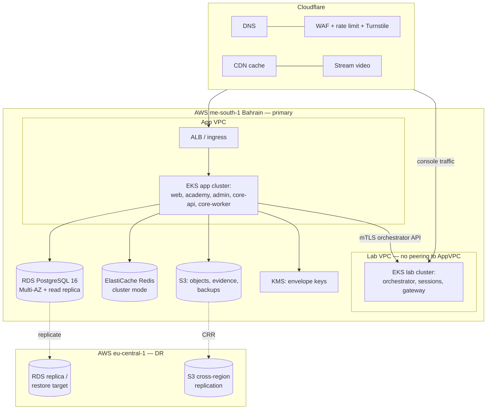

# 08 — Infrastructure & Delivery

Requirements: NFR-024 (backups/DR), NFR-030s (perf), NFR-040 (99.9%), NFR-080–085 (observability, IaC, CI/CD, environments, DR, on-call). Region decision: ADR-013.

## 1. Cloud topology



- **Primary region me-south-1 (Bahrain)** — lowest latency to the KSA/GCC beachhead and keeps MENA user data in-region (NFR-072 posture). DR in eu-central-1 (Frankfurt). ADR-013 records the trade-offs (me-south-1 has fewer AZs/services than us-east-1; acceptable, and it aligns data residency with the go-to-market).
- **Two EKS clusters, two VPCs, no peering** (doc 07): app and lab planes are network-isolated; the only bridge is the orchestrator mTLS API over a tightly-scoped, single-port path.
- Cloudflare fronts everything: DNS, CDN, WAF, DDoS, Turnstile, and Stream (video offloaded from origin — NFR-034).

## 2. Data stores

| Store | Service | Config |
|---|---|---|
| Primary DB | RDS PostgreSQL 16 | Multi-AZ, automated failover; read replica for analytics/read models; PgBouncer (transaction pooling) in-cluster; RLS-enforcing app role |
| Cache/queues/realtime | ElastiCache Redis | Cluster mode; separate logical uses (cache, BullMQ, rate-limit, pub/sub) with eviction policy only on the cache namespace |
| Objects | S3 | Versioning; separate buckets: public assets (CDN-fronted), private user files, **evidence (object-lock, no public path)**, backups; SSE-KMS |
| Search | Meilisearch | Self-hosted on app cluster (stateful set + EBS); rebuildable from Postgres (source of truth), so it is a cache, not a system of record |
| Secrets | AWS Secrets Manager + KMS | App reads at boot + rotation hooks; no secrets in env files or images (NFR-015) |

## 3. Infrastructure as Code (NFR-081)

- **Terraform** for all cloud resources; modules per concern (`network`, `eks`, `rds`, `redis`, `s3`, `cloudflare`, `observability`, `lab-vpc`); environments composed in `infra/terraform/envs/{staging,production}`. Remote state in S3 + DynamoDB lock. **No console-created resources** — drift detection in CI flags manual changes.
- **Kubernetes** manifests via Helm (per-deployable charts) + kustomize overlays per environment; lab-cluster manifests generated via cdk8s (typed) from the orchestrator repo. Secrets injected via External Secrets Operator from Secrets Manager. Network policies, pod security standards (restricted), and resource limits are chart-level defaults, not per-deploy afterthoughts.

## 4. Environments (NFR-083)

| Env | Purpose | Data |
|---|---|---|
| `local` | docker-compose + kind | Seeded synthetic bilingual data |
| `preview` | Per-PR ephemeral (namespace + preview DB) | Synthetic; auto-torn-down on merge/close |
| `staging` | Pre-prod mirror | Synthetic + anonymized; full integration/E2E/load targets run here |
| `production` | Live | Real; **no lower env ever reads production data** (hard rule — synthetic seed maintained in `packages/testing`) |

## 5. CI/CD (NFR-082, FR-AU-060)

```
PR opened
  ├─ lint · typecheck · unit (Vitest) · boundary check (dep-cruiser)
  ├─ integration (Testcontainers: pg+redis+meili)
  ├─ authz-matrix + tenant-isolation suites   ← run every deploy, doc 06 §5
  ├─ security: CodeQL/SAST · dependency audit · secret scan · container scan
  ├─ i18n completeness gate (ar/en parity)
  ├─ build · Lighthouse CI (ar+en, perf/a11y/SEO budgets) · size-limit
  ├─ E2E (Playwright, top-10 journeys, both locales) on preview deploy
  └─ preview environment posted to PR
merge to main
  ├─ build+push signed images · SBOM generated
  ├─ deploy staging · smoke + full E2E · load test on release-tagged changes
  └─ production: progressive rollout (canary → 100%) with automated rollback
        on SLO/error-budget breach; prod deploy = human approval gate
```

- **Critical vulnerabilities block deploy** (NFR-016). Images signed (cosign), SBOM published.
- **Rollback ≤10 min, tested** (NFR-082): previous image + backward-compatible migrations (expand/contract pattern is a Phase-3 migration rule) make rollback a routine, rehearsed action.
- Progressive delivery via Argo Rollouts (canary analysis on error rate + latency against SLO).

## 6. Observability (NFR-080)

- **OpenTelemetry** SDK across services → traces (Tempo), metrics (Prometheus), logs (Loki), dashboards (Grafana). Sentry for frontend + backend error tracking with release tagging.
- Every 5xx carries a support-referenceable `errorId` correlated to its trace (doc 03 §7).
- **SLO dashboards + error budgets** per service; burn-rate alerts. Golden signals per service; lab-cost and cost-per-learner are first-class business metrics on the same stack (NFR-042).
- Synthetic monitoring (uptime + key-journey probes) from multiple regions, both locales; public status page (NFR-040) driven by real checks.

## 7. Reliability, backup & DR (NFR-024, NFR-084)

- **Backups:** RDS automated + PITR (RPO ≤1h transactional); S3 versioning + cross-region replication; evidence bucket object-lock. Backup restores tested **quarterly** (a backup you haven't restored is a hope, not a backup).
- **RTO ≤4h, RPO ≤1h** targets; DR runbook in `docs/`; region-failure playbook promotes the eu-central-1 replica and repoints Cloudflare. DR exercise before GA and semi-annually (NFR-084).
- **Graceful degradation (NFR-041):** lab subsystem failure is isolated (separate cluster/VPC); payment provider outage fails over Stripe↔PayPal where the flow allows; search outage falls back to Postgres queries; Redis cache loss degrades to DB reads, not downtime.
- **On-call (NFR-085):** paging via the monitoring stack (FR-AU-062), severity matrix, bilingual incident comms templates, incident channel + status-page automation (FR-AU-054, FR-AU-063).

## 8. Security operations (NFR-023)

Auth anomalies, admin actions, evidence exports, lab-abuse events, and WAF signals feed a SIEM (managed OpenSearch or vendor) with alerting (FR-AU-053). Because INFOENC *sells* SOC and IR, its own platform SOC is both a necessity and a reference implementation — dogfooding the services we bill for. Quarterly access reviews and policy acknowledgments tracked (FR-AD-062); we hold ourselves to the ISO 27001 controls we consult on (NFR-074).
