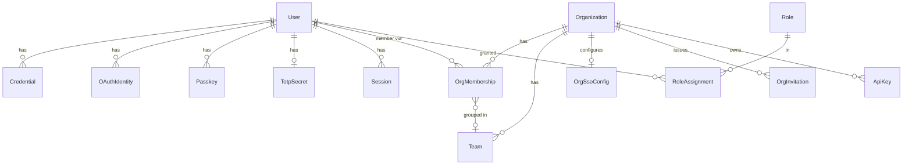
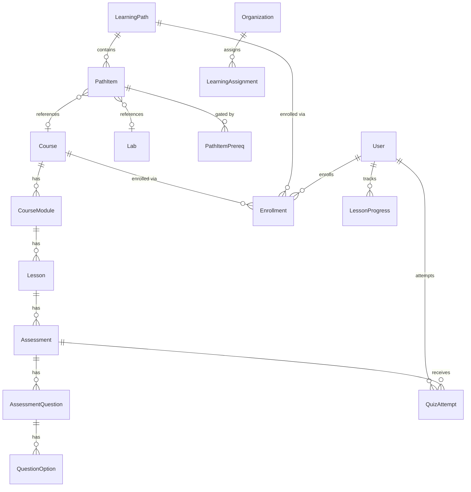
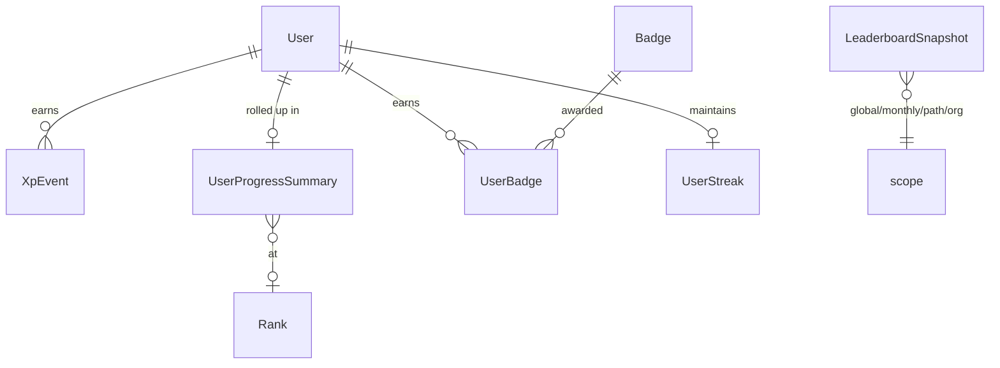
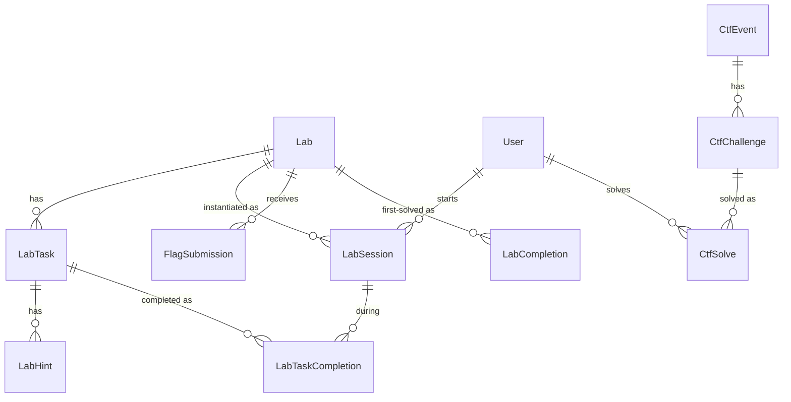
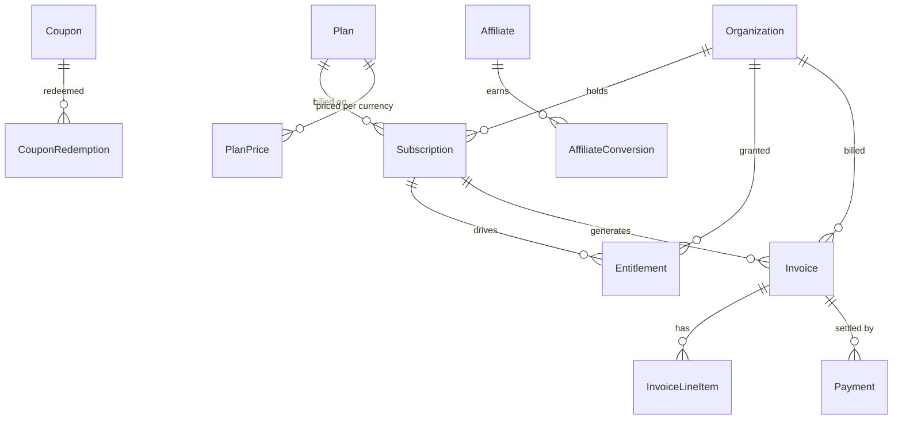
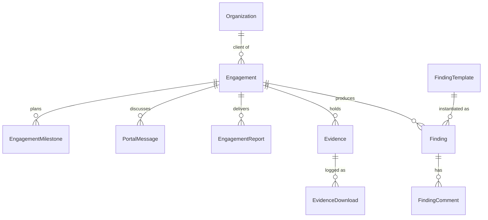
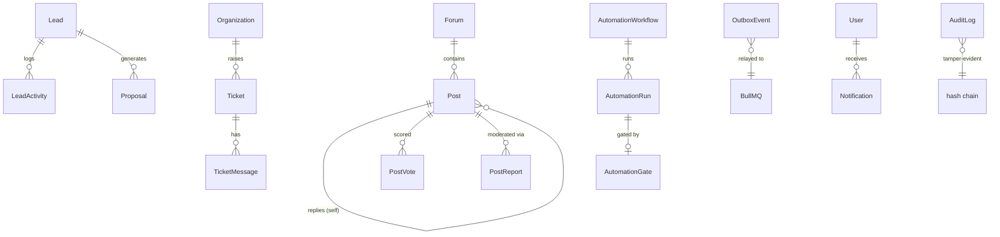

# 02 — Entity-Relationship Diagrams

Per-domain ERDs (the whole schema in one diagram is unreadable). Relationships shown are the load-bearing ones; translation tables are collapsed to a note where they'd add noise. Authoritative source is always `/prisma/schema/`.

## Identity & tenancy

Note: `User` is global; tenancy is expressed via `OrgMembership`. A personal learner = an `Organization(type: personal)` with one membership.

## Catalog & learning

Note: every content entity (`Course`, `Lesson`, `LearningPath`, `Assessment`, `Category`, question, option…) has a `*Translation` child keyed `(entityId, locale)` — the bilingual pattern (doc 01 §4).

## Gamification (XP as event log)

`XpEvent` is the source of truth (append-only, idempotent via `(userId, ruleKey, sourceType, sourceId)`); `UserProgressSummary` and `LeaderboardSnapshot` are rebuildable read models.

## Labs & CTF

`LabSession.orchestratorRef` is the only link to the lab cluster (Phase 2 doc 07); flag seeds are envelope-encrypted and never leave the server.

## Commerce

`Invoice` is an immutable ledger (numbered at issue); `Payment.providerEventId` and `WebhookEvent.providerEventId` guarantee idempotent settlement.

## Engagements (crown jewel)

Every row here carries `orgId` (RLS) and the sensitive bodies are `Bytes` cipher columns (field-level encryption, NFR-020). `onDelete: Restrict` on `Engagement`/`Finding`/`Evidence` — retention governs deletion, not user action (doc 05).

## CRM · Support · Community · CMS · Automation · Platform

## Table count by domain

| Domain | Tables (incl. translations) |
|---|---|
| identity | 8 |
| orgs | 6 |
| authz | 2 |
| catalog | 16 |
| learning | 9 |
| gamification | 10 |
| labs & ctf | 17 |
| commerce | 14 |
| engagements | 9 |
| crm | 3 |
| support | 4 |
| community | 6 |
| career | 6 |
| cms | 8 |
| automation | 3 |
| platform | 8 |
| **Total** | **~129 models** |

The MVP's 19 tables become ~129 — the growth is translations (bilingual mandate), the two new platforms (engagements, CRM, commerce, automation), and the integrity refactors (XP event log, invoice ledger, outbox). Every MVP table is accounted for in doc 03.
